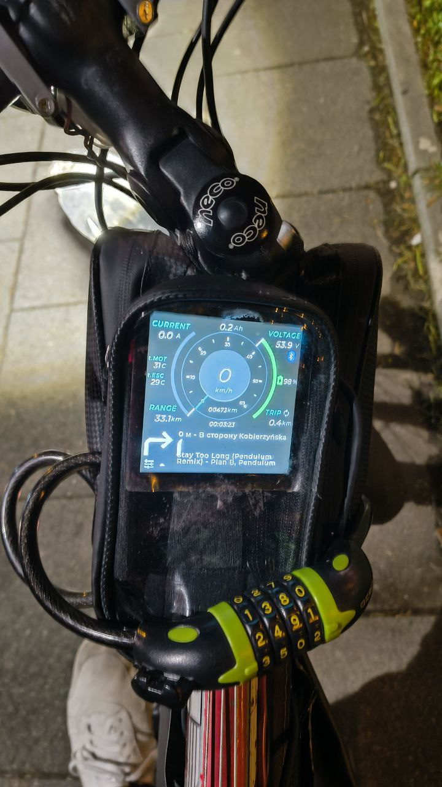

# Super VESC Display

Display for VESC controller based on ESP32-S3 with touchscreen and CAN/BLE communication support.



## 📋 Project Description

Super VESC Display is a full-featured display for VESC controllers, providing:
- Real-time telemetry display
- Touchscreen control
- CAN bus connection
- VESC Tool connection via BLE to VESC through CAN bus
- Smart battery calculation
- Trip statistics persistence

## 🔧 Hardware

### Board: ESP32-S3-Touch-LCD-4 (Waveshare)

**Specifications:**
- **Microcontroller**: ESP32-S3-N16R8 (16MB Flash, 8MB PSRAM)
- **Display**: 4" ST7701, 480x480 RGB parallel interface
- **Touchscreen**: GT911, 5-point capacitive
- **Interfaces**: CAN, RS485, I2C, MicroSD, RTC with battery backup

### Pinout

#### Display (RGB Parallel Interface)
```
RGB_DE_PIN      = 40
RGB_VSYNC_PIN   = 39
RGB_HSYNC_PIN   = 38
RGB_PCLK_PIN    = 41
RGB_R0-R4       = 46, 3, 8, 18, 17
RGB_G0-G5       = 14, 13, 12, 11, 10, 9
RGB_B0-B4       = 5, 45, 48, 47, 21
LCD_CS_PIN      = 42
LCD_Backlight   = 2
```

#### Touchscreen (GT911 I2C)
```
GT911_SDA_PIN   = 15
GT911_SCL_PIN   = 7
GT911_INT_PIN   = 4
```

#### CAN (TWAI)
```
CAN_TX_PIN      = 48
CAN_RX_PIN      = 47
```

## 🚀 Quick Start

### Requirements

- PlatformIO IDE or VS Code with PlatformIO extension
- ESP32-S3-Touch-LCD-4 board
- VESC controller with CAN support

### Installation

1. **Clone the repository:**
```bash
git clone https://github.com/payalneg/Super_VESC_DIsplay.git
cd Super_VESC_Display
```

2. **Install dependencies:**
```bash
pio lib install
```

3. **Build the project:**
```bash
pio run
```

4. **Upload firmware:**
```bash
pio run --target upload
```

5. **Open Serial Monitor:**
```bash
pio device monitor
```

## 🔌 VESC Connection

### Option 1: Direct CAN Connection (Recommended)

#### Required Equipment:
- CAN transceiver (TJA1050, MCP2551, or SN65HVD230)
- 120Ω termination resistors (at both ends of CAN bus)

#### Connection Diagram:
```
ESP32-S3     CAN Transceiver    VESC
GPIO 48  →   CTX (TX)          
GPIO 47  ←   CRX (RX)          
3.3V     →   VCC              
GND      →   GND      →        GND
                    CAN_H  →   CAN_H
                    CAN_L  →   CAN_L
```

#### VESC Configuration:
1. Connect VESC to computer via USB
2. Open VESC Tool
3. Go to **App Settings → CAN**
4. Set:
   - **CAN ID**: Choose your ID and set it in device settings
   - **CAN Baud Rate**: 500k
   - **Send Status**: Not required
5. Click "Write Configuration"
6. Disconnect USB, connect CAN

#### Connection Verification:
In Serial Monitor you should see:
```
VESC TWAI driver installed successfully
VESC TWAI driver started successfully
VESC: 0.0 km/h | 42.0V (85%) | 0W
```

## 📱 BLE Functionality

### BLE Bridge for VESC Tool

The device acts as a BLE-CAN bridge, allowing connection to VESC through mobile applications.

**Device Name:** `SuperVESCDisplay`

**Service:** Nordic UART Service
- **RX UUID**: `6E400002-B5A3-F393-E0A9-E50E24DCCA9E` (Write)
- **TX UUID**: `6E400003-B5A3-F393-E0A9-E50E24DCCA9E` (Notify)

**Protocol:**
- VESC command support with framing
- Automatic fragmentation of large packets
- CRC16 validation
- Compatible with official VESC Tool

### Additional BLE Features

- **BLE Keyboard**: HID keyboard emulation
- **Media Control**: Media control and current song display
- **OTA Update**: Firmware update via BLE
- **Bluetooth Client**: Connection to external devices

## ⚙️ Settings and Configuration

### Settings Screen

Available settings via touchscreen:

#### Battery Configuration
- **Battery Capacity (Ah)**: Battery capacity (1.0 - 200.0 Ah)
- **Battery Calculation Mode**:
  - **Direct from Controller**: Percentage based on voltage
  - **Smart Calculation**: Calculation based on Ah consumption

#### VESC Motor Limits
- **Motor Current Max**: Maximum motor current (5.0 - 200.0 A)
- **Battery Current Max**: Maximum battery current (5.0 - 200.0 A)
- **ERPM Max**: Maximum speed (10k - 200k ERPM)
- "Read Limits from VESC" and "Apply Limits to VESC" buttons

#### Display Settings
- **Screen Brightness**: Screen brightness (0-100%)

### Smart Battery Calculation

**Smart Calculation Mode** provides more accurate battery charge calculation:

**How it works:**
1. Tracks actual Ah consumption instead of voltage
2. Automatically detects charging (>10% increase)
3. Saves state every 30 seconds to NVS
4. Accounts for regenerative braking
5. Restores state after reboot

**When to use:**
- ✅ For more accurate charge display
- ✅ With variable power consumption
- ✅ For better range estimation
- ✅ With regenerative braking

**Calibration:**
- Automatic when charging is detected
- Manual reset by changing battery capacity
- State persists across reboots

### Trip Statistics Persistence

**Trip Persistence:**
- Automatic saving of trip distance and Ah every 10 seconds
- Value restoration on device power-on
- Automatic detection of VESC reset (power cycle)
- Manual reset function for battery replacement

**Usage:**
```cpp
// Get trip distance
float trip_km = vesc_rt_data_get_trip_km();

// Get consumed Ah
float amp_hours = vesc_rt_data_get_amp_hours();

// Reset on battery replacement
battery_calc_reset_trip_and_ah();
```

### Range Calculation

**Algorithm:**
- Uses Ah/km instead of Wh/km for better accuracy
- Recalculates every 100 meters or 0.1 Ah
- Caches result for stable readings
- Integrated with smart battery calculation

**Formula:**
```
Range = remaining_ah / (consumed_ah / distance_km)
```

## 📊 Displayed Data

### Dashboard (Main Screen)


The dashboard displays:
- Connection indicators
- Battery voltage
- Battery charge percentage
- **CURRENT A**: Motor current
- **SPEED**: Speed in km/h (large digits)
- **POWER W**: Power in watts
- **Time**: Current time
- **Gear**: Gear number
- **Battery**: Vertical charge bar
- **ESC °C**: Controller temperature
- **MOTOR**: Motor temperature
- **TRIP KM**: Trip distance
- **RANGE**: Range estimate

## 🛠️ Development

### Project Structure

```
Super_VESC_Display/
├── src/                    # Source code
│   ├── main.cpp           # Main file
│   ├── Display_ST7701.*   # Display driver
│   ├── Touch_GT911.*      # Touchscreen driver
│   ├── comm_can.*         # CAN communication
│   ├── ble_*.cpp          # BLE modules
│   ├── vesc_*.cpp         # VESC data processing
│   └── ...
├── Super_VESC_Display/     # LVGL GUI Builder files
│   ├── generated/         # Generated GUI code
│   ├── custom/            # Custom code
│   └── lvgl/              # LVGL library
├── platformio.ini         # PlatformIO configuration
└── README.md              # This file
```

### Main Modules

- **`comm_can.*`**: CAN communication with VESC
- **`vesc_handler.*`**: VESC command processing
- **`vesc_rt_data.*`**: Real-time telemetry processing
- **`vesc_battery_calc.*`**: Smart battery calculation
- **`vesc_trip_persist.*`**: Statistics persistence
- **`vesc_limits.*`**: Motor limits management
- **`ble_vesc_driver.*`**: BLE bridge for VESC
- **`ui_updater.*`**: Interface updates
- **`dev_settings.*`**: Settings system

**Note for GUI developers:** See `Super_VESC_Display/SETTINGS_GUI_INTEGRATION.md` for information on working with GUI Builder and settings integration.

### Dependencies

```ini
lib_deps =
    https://github.com/moononournation/Arduino_GFX.git#v1.6.0
    h2zero/NimBLE-Arduino@^1.4.1
```

### Build and Debug

**Build:**
```bash
pio run
```

**Upload:**
```bash
pio run --target upload
```

**Monitor:**
```bash
pio device monitor --baud 115200
```

**Clean:**
```bash
pio run --target clean
```

## 🔍 Troubleshooting

### CAN Connection Issues

**"Failed to install VESC TWAI driver"**
- Check that GPIO pins 48/47 are free
- Reboot ESP32

**"VESC: Disconnected"**
- Check CAN transceiver connection
- Ensure VESC is configured correctly
- Check CAN_H and CAN_L connections
- Add 120Ω termination resistors

**"Bus error occurred"**
- Check connection quality
- Verify CAN_H/CAN_L polarity
- Check wire length (no more than 1m for 500kbps)

### BLE Issues

**Device not visible when scanning**
- Check that BLE is initialized
- Ensure device name is "SuperVESCDisplay"
- Reboot device

**No response from VESC via BLE**
- Check CAN connection to VESC
- Ensure VESC is configured to send status
- Check logs in Serial Monitor

### Battery Issues

**Battery percentage seems incorrect**
- Check battery capacity setting
- Try switching to Direct mode
- Reboot device for calibration

**Percentage increases during use**
- This is normal during regenerative braking
- Check regenerative braking settings in VESC

### Display Issues

**Screen won't turn on**
- Check power connection
- Check display pins
- Ensure backlight is enabled

**Touchscreen not working**
- Check I2C connection (SDA/SCL)
- Check GT911 INT pin
- Reboot device

## 📚 Additional Information

### VESC Commands

Supported commands:
- `COMM_FW_VERSION` - Firmware version
- `COMM_GET_VALUES` - Get current values
- `COMM_SET_DUTY` - Set duty cycle
- `COMM_SET_CURRENT` - Set current
- `COMM_SET_RPM` - Set RPM
- `COMM_GET_MCCONF` - Get motor configuration
- `COMM_SET_MCCONF` - Set motor configuration

### Formulas and Calculations

**ERPM → RPM (mechanical speed):**
```
RPM = ERPM / motor_pole_pairs
```

**RPM → Speed (for wheel):**
```
speed_kmh = (RPM * wheel_diameter_m * π * 60) / 1000
```

**Current → Power:**
```
power_watts = voltage_v * current_a
```

## 📝 License

See LICENSE file in the project root.

## 🤝 Support

For questions and issues, create an issue in the project repository.

---

**Firmware Version**: 1.00  
**Last Update**: 2025
